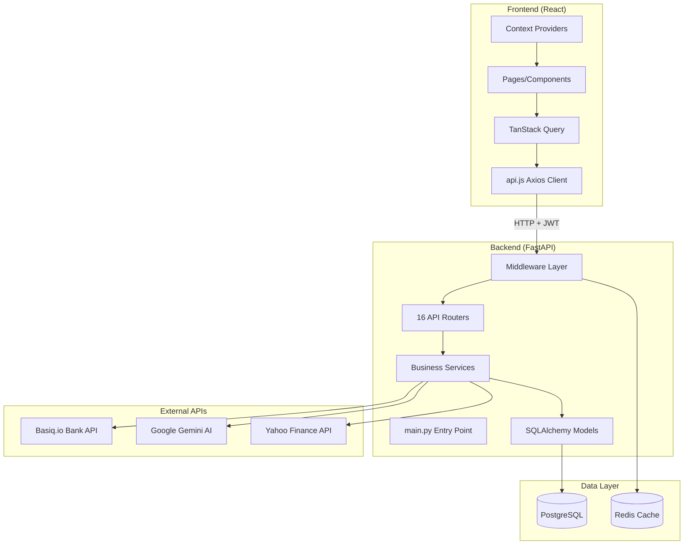
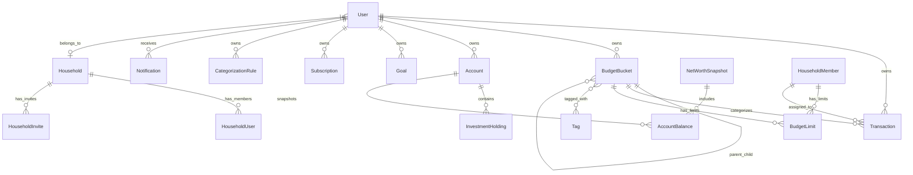

# DollarData - System Architecture Map

> **Long-Term Context Memory** for AI-assisted development. Last updated: January 2026.
> 
> 🗺️ **[Feature Roadmap](ROADMAP.md)** available.

---

## 🤖 Agent Onboarding (READ FIRST)

> **⚠️ CRITICAL: DO NOT USE `&&` IN SHELL COMMANDS.**
> This environment uses **PowerShell** on Windows. Chaining commands with `&&` fails.
> Use `;` for sequential execution or separate `run_command` calls.

> **🎨 DESIGN SYSTEM COMPLIANCE:**
> **ALWAYS** use design tokens (e.g., `bg-card`, `text-text-primary`, `border-border`).
> **NEVER** hard-code styles (e.g., `bg-white`, `text-slate-900`, hex codes).
> **ACTION:** Run `/audit-brand` to verify compliance.

> **Before making any changes**, review these critical patterns and files.

### Critical Files to Check

| File | Why It Matters |
|------|----------------|
| `backend/auto_migrate.py` | **Auto-migrations run on startup**. Add new columns here for automatic deployment. |
| `backend/main.py` | Entry point. Calls `auto_migrate.run_migrations()` on startup. |
| `backend/database.py` | DB connection. Uses `DATABASE_URL` env var (PostgreSQL in prod, SQLite in dev). |
| `backend/models.py` | SQLAlchemy models. Schema changes here need corresponding migration. |
| `backend/schemas.py` | Pydantic schemas. Must match models for API serialization. |
| `.env` | Environment variables (gitignored). Contains `DATABASE_URL`, `SECRET_KEY`, etc. |

### Deployment Pattern

- **VPS**: Binary Lane (not Render)
- **Containerization**: Docker Compose (backend + frontend + postgres containers)
- **Database**: PostgreSQL on production, SQLite locally
- **Branches**: `main` is the production/stable branch used for deployment. Feature development occurs on `trade-logic`.
- **Deploy workflow**:
  ```bash
  cd /opt/dollardata
  git pull origin main
  docker compose build backend   # Rebuild to install new dependencies
  docker compose up -d           # Restart all containers
  ```
- **Auto-migrations** run on container startup via `auto_migrate.py`

### Schema Change Checklist

When adding a new column to any model:
1. ✅ Add to `backend/models.py`
2. ✅ Add to `backend/schemas.py` (if exposed via API)
3. ✅ Add to `backend/auto_migrate.py` (for automatic deployment)
4. ✅ Commit and push to GitHub
5. ✅ On VPS: `git pull` and restart backend

### Common Pitfalls

- ⚠️ **Don't commit `.db` files** - They're gitignored but may be tracked from old commits
- ⚠️ **SQLite vs PostgreSQL** - Local dev uses SQLite, production uses PostgreSQL
- ⚠️ **Auto-migrate only handles ADD COLUMN** - Complex migrations need manual scripts (e.g. `CREATE TABLE` in `auto_migrate.py`)

---

## High-Level Summary

**DollarData** is a comprehensive personal finance management application built for Australian users. It enables transaction tracking, budget management, net worth monitoring, investment portfolio tracking, and AI-powered financial insights. The platform supports multi-user household sharing with role-based access control, bank integration via Basiq.io, spending habits/category goals tracking, and a rich dashboard with customizable widgets.

---

## Tech Stack Overview

| Layer | Technology | Purpose |
|-------|------------|---------|
| **Backend** | FastAPI (Python 3.10+) | REST API framework |
| **Frontend** | React 19 + Vite | SPA with modern React |
| **Database** | PostgreSQL + SQLite (dev) | Primary data store |
| **Cache** | Redis | Session/response caching |
| **ORM** | SQLAlchemy 2.0 | Database abstraction |
| **State Management** | TanStack Query v5 | Server-state caching |
| **Routing** | react-router-dom v7 | Client-side navigation |
| **Styling** | Tailwind CSS v4 | Utility-first CSS + Design Tokens (`@theme`) |
| **Auth** | Supabase Auth (JWT) | Managed Authentication |
| **Deployment** | Docker + Binary Lane VPS | Containerized hosting |
| **Error Monitoring** | Sentry | Production error tracking |

---

## Key Directories

| Directory | Responsibility |
|-----------|----------------|
| `backend/` | FastAPI application - API server, models, services |
| `backend/routers/` | API route handlers organized by domain (16 routers) |
| `backend/services/` | Business logic, AI services, third-party integrations |
| `backend/migrations/` | Database schema migrations |
| `backend/models.py` | SQLAlchemy ORM models (27+ entities). `User` maps to `public.profiles`. |
| `backend/schemas.py` | Pydantic request/response schemas |
| `frontend/` | React application - UI components and pages |
| `frontend/src/pages/` | Page-level components (26 pages) |

---

## Environment Variables

| Variable | Required | Purpose |
|----------|----------|---------|
| `DATABASE_URL` | Yes | PostgreSQL connection string (Supabase Pooler) |
| `SUPABASE_URL` | Yes | Supabase Project URL (for JWKS/API) |
| `SUPABASE_JWT_SECRET` | Yes | HS256 JWT Verification Secret |
| `SUPABASE_SERVICE_ROLE_KEY` | Yes | Admin API Access |
| `ENVIRONMENT` | No | `development` / `production` |
| `CORS_ORIGINS` | No | Allowed frontend origins |
| `GEMINI_API_KEY` | No | AI features |
| `BASIQ_API_KEY` | No | Bank integration |
| `SENTRY_DSN` | No | Error monitoring |
| `REDIS_URL` | No | Caching |
| `frontend/src/components/` | Reusable UI components (62 components in 5 subdirs) |
| `frontend/src/components/widgets/` | Dashboard widget components (14 widgets) |
| `frontend/src/components/settings/` | Settings tab components (10 components) |
| `frontend/src/context/` | React context providers (Auth, Theme, Toast, Notification) |
| `frontend/src/services/` | API client (Axios wrapper) |
| `frontend/src/hooks/` | Custom React hooks (2 hooks) |
| `scripts/` | Utility scripts for migrations, testing, deployment |
| `tests/` | Backend test suite (pytest, 23 test files) |
| `.github/` | CI/CD workflows |
| `docs/` | Project documentation |

---

## Data Flow Diagram



---

## API Router Reference

| Router File | Prefix | Domain |
|-------------|--------|--------|
| `auth.py` | `/auth` | Authentication, MFA, password reset, session management |
| `settings.py` | `/settings` | User settings, buckets, rules, members, notification prefs |
| `transactions.py` | `/transactions` | CRUD operations, splitting, bulk actions |
| `analytics.py` | `/analytics` | Dashboard data, trends, forecasting, AI chat |
| `net_worth.py` | `/net-worth` | Accounts, snapshots, balances, holdings |
| `investments.py` | `/investments` | Portfolio tracking, history |
| `goals.py` | `/goals` | Savings goals tracking |
| `rules.py` | `/rules` | Transaction categorization rules (aliases to settings) |
| `ingestion.py` | `/ingestion` | CSV/PDF import, bank sync |
| `connections.py` | `/connections` | Basiq bank connections |
| `notifications.py` | `/notifications` | User notifications, bill reminders |
| `market.py` | `/market` | Stock ticker search, quotes |
| `taxes.py` | `/taxes` | Tax estimation (AU-specific) |
| `export.py` | `/export` | Data export (CSV/JSON) |
| `api_keys.py` | `/api-keys` | Personal API key management |
| `household.py` | `/household` | Family sharing, invites, permissions |

---

## Core Data Models



**Key Entities:**
- `User` - Authentication, settings, household association
- `Transaction` - Income/expense records with categorization
- `BudgetBucket` - Hierarchical categories with limits
- `Account` - Bank/investment/liability accounts
- `InvestmentHolding` - Stock/ETF positions within accounts
- `Subscription` - Recurring expense tracking
- `CategorizationRule` - Auto-categorization rules with priority ordering
- `Household` - Multi-user family sharing container
- `HouseholdMember` - Spending profiles for budget allocation

---

## Recent Changes & Fixes
- **Import Handling Fixes (Jan 2026):**
  - **Job Persistence:** Moved background job content from memory to DB (`background_jobs` table) to support multi-worker Gunicorn deployments.
  - **Schema Fix:** Added UUID validation to `Transaction` schema to prevent 502/500 errors during confirm.
  - **Deduplication:** Added secondary hash check in `confirm_transactions` to prevent duplicate inserts on retry.
  - **502 Startup Fix:** Added explicit table creation in `auto_migrate.py` and robust config checks in `main.py` to prevent crash loops.
  - **Files:** `backend/routers/ingestion.py`, `backend/models.py`, `backend/schemas.py`, `backend/auto_migrate.py`, `backend/main.py`.

- **Auth & Registration Overhaul (Jan 2026):**
  - **Account Deletion:** Fixed "Zombie Account" bug where deleted users could respawn. Added Supabase Admin API deletion to `delete_account` endpoint.
  - **Registration Fixes:** Resolved 504 Gateway Timeouts by optimizing JIT provisioning and identifying SMTP blockers.
  - **Email Verification:** Re-enabled Supabase email confirmations with proper UI feedback (no more silent redirects).
  - **SMTP Setup:** Configured Office 365 "Send As" delegation for `noreply@dollardata.au` to fix delivery issues.
  - **UI Polish:** Updated Registration page with brand logo and professional "Check your inbox" success screen.
- **Family Sharing Fix (Jan 2026):**
  - **500 Error Resolved:** Fixed critical `ValidationError` where `owner_id` (UUID) was incorrectly typed as `Integer` in Pydantic schemas.
  - **Account Deletion:** Implemented "Delete Account" feature with robust foreign key cleanup (cascading deletes for households, invites, members).
  - **Backend:** Updated `routers/auth.py` and `schemas.py` to handle UUIDs correctly.
  - **Frontend:** Added "Danger Zone" to Data Settings with confirmation modal.
- **Trade Logic (Jan 2026):**
  - Renamed "Add Investment" to "Add Trade" with Buy/Sell/Dividend/DRIP support.
  - New `Trade` model for tracking individual transactions.
  - CSV import/export for bulk trade entry.
  - New components: `AddTradeModal.jsx`, `ImportTradesModal.jsx`.
- **Demo Account:**
  - Added `seed_demo_user.py` script for seeding demo data.
  - "Try Demo" button on login page (`demo@dollardata.app` / `demo123`).
  - Generates 12+ months of realistic transactions, categories, accounts, investments.
- **Bug Fixes:**
  - Fixed Budget Categories page showing flat list on initial load (React Query cache key conflict).
- **Transactions:**
  - Added "Create & Add Another" button (Frontend).
  - Added "Manual Transaction" entry modal.
  - Fixed Inline Date Edit bug (Backend Schema update).
  - Widened Transaction table to 95% viewport width.
- **Subscriptions:**
  - **Shared Subscriptions:** Added `parent_id` (Self-referential FK) to link reimbursements to expenses.
  - Added "Net Cost" calculation for grouped subscriptions.
  - Fixed 500 Error (Missing column migration).
- **Dashboard Budget Fixes:**
  - Standardized month difference calculation.
  - **Sankey Diagram:** Added "Deficit" node logic to balance diagram when Expenses > Income (visual fix).
  - **Budget Cards:** Fixed Subcategory categorization. "Wants" subcategories (e.g. Dining Out) now separated from "Needs" parents (e.g. Food).
  - Added vote `created_at` timestamp to User model.
  - Added `bucket_id` linking for `Subscription` model.
  - **Budget History:**
    - Modified backend to always return 12 months (or selected period range) of history.
    - Added blue highlight for selected period in Sparkline charts.
  - **Sankey Diagram:**
    - **Reconciliation:** Added explicit "Reconciling Item" node to handle Income vs Outflow differences.
    - **Income Fix:** Fixed mismatch by using net amounts (consistent with Dashboard) and merged buckets named "Income" into "Other Income" to prevent self-loops.
    - **Subcategories:** Subcategory spending now flows to its own group (Non-Disc/Disc), not the parent's group.
  - **Split Transactions:**
    - Refined UI: Positive inputs only, auto-balance for 2 splits.
    - Fixed logic: Logic now modifies parent transaction (Split 1) + creates new sibling (Split 2).
    - Fixed Budget Refunds: Removed validation filter to allow positive "refund" transactions in budget analysis.
  - **Net Worth Refinements:**
    - **Investments Tab:** Merged standalone Investments page into Net Worth as a tab.
    - **Sankey Diagram:** Removed scroll container; widget now auto-expands height based on content.
  - **Auth/System:**
    - **Logout Fix:** Cleared TanStack Query cache on logout to prevent stale data persisting between sessions.
- **Budget Performance Tab:**
  - New spreadsheet-style view showing 12 months of category spend data.
  - **Backend:** Added `/analytics/performance` endpoint returning spend history, average, and variance columns.
  - **Frontend:** New `BudgetPerformanceTab.jsx` component with freeze panes (sticky Category column), collapsible parent/child rows, and clickable month columns to update variance display.
  - Child categories now correctly display in their own Needs/Wants section, not their parent's group.
  - Member filter toggle (Total Household, Joint, individual members).
- **Design Token System (Midfunnel-Inspired):**
  - Added centralized design tokens in `index.css` via Tailwind v4 `@theme` directive.
  - Tokens include: primary colors (#5D5DFF), surface colors, text, borders, shadows, and radius.
  - Added Inter font from Google Fonts.
  - Created `frontend/BRAND GUIDELINES.md` with migration guide.
  - See `tailwind.config.js` for token definitions.
- **Bug Fixes (January 2026):**
  - **NotificationProvider:** Moved to `PrivateRoute.jsx` to prevent crashes on public routes.
  - **SummaryCardsWidget:** Added null checks for `totals` and `netWorth` props.
  - **NotificationContext:** Added `Array.isArray()` check before filtering notifications.
- **Reports & Analytics Refinements (January 2026):**
  - **Time Picker:** Added "Last Month" option to date range selector.
  - **Category Filter UI:** Fixed z-index issue where checkboxes overlapped sticky group headers.
  - **Category Filter Logic:** Added `exact_bucket_ids` backend parameter to prevent automatic hierarchy expansion when child categories are deselected.
  - **Chart Labels:** Replaced inline pie chart labels with `Legend` component for better readability and no cutoff.
  - **PDF Export (v1):**
    - Added endpoints for Professional PDF generation with Charts, Summary, and Category Breakdown (`GET /export/report/pdf`).
    - Added simple Excel export (`GET /export/report/excel`).
    - Implemented vector logo drawing logic.
    - **Known Issue:** PDF layout needs spacing adjustments (legends overlap) and logo rendering needs verification.
- **UI Unification:**
  - **Budget Page Tabs:** Changed from pill-style tabs (right-aligned) to underline-style tabs (left-aligned) to match Reports page.
  - **Page Container Layout:** Removed inconsistent `-m-8` wrappers in ReportsHub; Reports and Calendar pages now use consistent container styling.
- **App Rename (Principal → DollarData) - COMPLETE:**
  - Updated frontend branding: `index.html`, `App.jsx`, `Login.jsx`, `Footer.jsx`, `FeedbackModal.jsx`.
  - Updated legal pages: `TermsOfService.jsx`, `PrivacyPolicy.jsx`.
  - Updated backend: `main.py` (API title, contact, welcome message).
  - Updated AI assistant prompt in `ai_assistant.py`.
  - Updated documentation: `ROADMAP.md`, `CONTEXT_MAP.md`, `feature_documentation.md`, `Feature Roadmap.md`, `BRAND GUIDELINES.md`.
  - **Logo:** Replaced generic bar chart favicon with official DollarData "D" logo (`frontend/public/logo.svg`).
  - **Docker config:** Network, DB user/password/name updated to `dollardata` in `docker-compose.yml`.
  - **Backend config:** `config.py`, `database.py`, `gunicorn.conf.py` updated.
  - **Deployment:** `deploy.md`, `BACKUP_STRATEGY.md`, `HTTPS_ENFORCEMENT.md`, `POSTGRESQL_SETUP.md` paths updated.
  - **Demo account:** Email changed from `demo@principal.finance` → `demo@dollardata.app`.
  - **Pending:** VPS folder rename (`/opt/principal` → `/opt/dollardata`) - completed during deployment.
  - **Pending:** Configure `dollardata.au` domain (awaiting GoDaddy ID verification).

## Known Issues
- **Asset Allocation:** Needs UI fixes and split between ETFs/Stocks.

---

## Crucial Files (High Complexity)

> ⚠️ **Extra caution required** when editing these files.

| File | Lines | Complexity Reason |
|------|-------|-------------------|
| `backend/routers/analytics.py` | ~2,100 | Largest router. Complex aggregation queries for dashboard, trends, forecasting, anomaly detection, AI chat integration. |
| `frontend/src/pages/DataManagement.jsx` | ~1,300 | Multi-tab import/export, CSV parsing, PDF upload, Basiq integration, confirmation dialogs. |
| `frontend/src/pages/Transactions.jsx` | ~1,200 | Complex table with filtering, sorting, bulk selection, inline editing, category dropdowns, and keyboard shortcuts. |
| `frontend/src/pages/NetWorth.jsx` | ~950 | Account cards, investment holdings, balance snapshots, chart visualization, inline editing. |
| `backend/routers/ingestion.py` | ~800 | Multi-format parsing (CSV/PDF), bank sync, transaction deduplication, validation. |
| `frontend/src/components/RulesSection.jsx` | ~900 | Drag-drop rule ordering, preview matching, complex form state, multi-condition rules. |
| `backend/routers/auth.py` | ~1,100 | MFA flow, password reset, email verification, session management, Google OAuth. |
| `frontend/src/pages/Subscriptions.jsx` | ~750 | Recurring detection, manual entries, bucket mapping, calendar visualization. |
| `backend/models.py` | ~441 | All 27+ SQLAlchemy models. Central schema definition. |
| `backend/schemas.py` | ~450 | All Pydantic validation schemas. Breaking changes affect API contracts. |

---

## State Management Pattern

1. **Server State** - TanStack Query (`@tanstack/react-query`)
   - Caches API responses with `staleTime: 5min` and `cacheTime: 10min`
   - Query invalidation on mutations
   - Optimistic updates for responsiveness

2. **Auth State** - `AuthContext.jsx`
   - JWT tokens in localStorage
   - Auto-refresh via Axios interceptor in `api.js`

3. **UI State** - React Context
   - `ThemeContext` - Light/dark mode
   - `ToastContext` - Toast notifications
   - `NotificationContext` - Bell notifications

4. **Local Component State** - `useState`, `useReducer`

---

## External Dependencies

| Service | Purpose | Config Location |
|---------|---------|-----------------|
| **Basiq.io** | Australian open banking API | `BASIQ_API_KEY` env var, `services/basiq.py` |
| **Google Gemini** | AI categorization & chat | `GEMINI_API_KEY` env var, `services/ai_*.py` |
| **Yahoo Finance** | Stock prices via `yfinance` | `routers/market.py`, `services/` |
| **Sentry** | Error monitoring | `SENTRY_DSN` env var |
| **Redis** | Caching (optional) | `REDIS_URL` env var |
| **SMTP** | Email (password reset, invites) | SMTP env vars (GoDaddy via Microsoft 365) |

---

## Environment Variables

| Variable | Required | Purpose |
|----------|----------|---------|
| `DATABASE_URL` | Yes | PostgreSQL connection string |
| `SECRET_KEY` | Yes | JWT signing key |
| `ENVIRONMENT` | No | `development` / `production` |
| `CORS_ORIGINS` | No | Allowed frontend origins |
| `GEMINI_API_KEY` | No | AI features |
| `BASIQ_API_KEY` | No | Bank integration |
| `SENTRY_DSN` | No | Error monitoring |
| `REDIS_URL` | No | Caching |

---

## Development Commands

```bash
# Backend
cd backend
pip install -r requirements.txt
uvicorn main:app --reload --port 8000

# Frontend
cd frontend
npm install
npm run dev  # Vite dev server on :5173

# Testing
pytest                    # Backend tests
npm run test             # Frontend tests (vitest)
npm run test:coverage    # With coverage

# Docker (full stack)
docker-compose up

# Seed Demo Data (VPS deployment)
docker cp /opt/dollardata/scripts/seed_demo_user.py $(docker compose ps -q backend):/app/seed_demo_user.py
docker compose exec backend python /app/seed_demo_user.py
```

---

## Routing Structure (Frontend)

| Path | Page Component | Description |
|------|----------------|-------------|
| `/` | `Dashboard.jsx` | Main dashboard with widgets |
| `/transactions` | `Transactions.jsx` | Transaction list & management |
| `/budget` | `Budget.jsx` | Budget categories & limits |
| `/net-worth` | `NetWorth.jsx` | Accounts & snapshots |
| `/investments` | `Investments.jsx` | Portfolio tracker |
| `/goals` | `Goals.jsx` | Savings goals |
| `/reports` | `Reports.jsx` | Spending reports & trends |
| `/settings` | `Settings.jsx` | User & app settings |
| `/subscriptions` | `Subscriptions.jsx` | Recurring expenses |
| `/calendar` | `FinancialCalendar.jsx` | Transaction calendar view |
| `/insights` | `Insights.jsx` | AI-powered insights |
| `/review` | `Review.jsx` | Transactions needing review |
| `/login` | `Login.jsx` | Authentication |
| `/register` | `Register.jsx` | User registration |

---

## Testing Strategy

- **Backend**: pytest with 68+ tests covering auth, API endpoints, services
- **Frontend**: Vitest + React Testing Library
- **CI**: GitHub Actions (`.github/workflows/`)

---

## Notable Patterns

1. **Hierarchical Categories** - `BudgetBucket` supports parent/child relationships for nested budgets
2. **Rule Priority** - `CategorizationRule.priority` determines execution order (lower = higher priority)
3. **Household Sharing** - All data scoped to `household_id` for multi-user access
4. **Drag-Drop** - Uses `@dnd-kit` for widget reordering and rule prioritization
5. **Toast Notifications** - Custom `ToastContext` replaces browser alerts
6. **Command Palette** - `Cmd/Ctrl+K` for quick navigation
7. **Demo Account** - `demo@dollardata.app` / `demo1234` with realistic sample data

---

## 📋 Recent Changes & Fixes

\u003e Last updated: 2026-01-10

### **Design Token System (Jan 2026)**
- Migrated entire frontend to use semantic design tokens defined in `index.css` via Tailwind v4 `@theme`.
- **Key Tokens:**
  - `bg-surface` / `bg-card` (Backgrounds)
  - `text-text-primary` / `text-text-secondary` (Typography)
  - `bg-primary` (Brand Action Color)
  - `border-border` (Universal border color)
- **Dark Mode:** All tokens support dark mode natively via `dark:` variants or CSS rules.
- **Pattern:** Using semantic names (e.g., `text-accent-error`) instead of hardcoded hex/utility colors (e.g., `text-red-500`).

### **Supabase JWT Authentication Migration**
- Migrated from legacy JWT auth to Supabase Auth with ES256 token signing
- Added static JWK verification using `SUPABASE_JWT_KEY` environment variable  
- Implemented Just-In-Time (JIT) user provisioning from Supabase to local database
- Key files: `backend/auth.py`, `docker-compose.yml`, `.env`

### **UUID Serialization Fixes**
- Fixed Pydantic `ResponseValidationError` where database returned UUID objects but schemas expected strings
- Added `field_validator` to convert UUIDs to strings in response models
- Fixed schemas: `User`, `HouseholdMember`, `Goal`, `Subscription`, `Rule`
- Key file: `backend/schemas.py`

### **FastAPI Routing Improvements**
- Fixed 307 redirect issues caused by trailing slash mismatch between frontend and backend
- Updated route decorators to handle both `/endpoint` and `/endpoint/` patterns
- Affected routers: `transactions.py`, `goals.py`

### **Net Worth Repair (Jan 2026)**
- **Gap Filling:** Upgraded `recalculate_all_snapshots` to automatically backfill missing balance records from previous months.
- **Chart Colors:** Standardized all charts to use `chartColors.js` palette (Indigo/Red/Rainbow).

- **Files:** `backend/routers/net_worth.py`, `frontend/src/constants/chartColors.js`.

### **Breakdown Chart Refinements (Jan 2026)**
- **Simplified Categories:** "Net Property" (property assets - mortgage), combined "Liabilities", and other asset categories.
- **Colorblind Accessibility:** Reordered `CHART_COLORS` palette (Amber-Cyan-Indigo-Emerald) for maximum color distinction.
- **Dark Mode Legend:** Added semi-transparent background container for legend visibility in both themes.
- **Net Worth Line:** Dashed line overlay (#64748b slate gray) with custom legend icon.
- **Zero Line:** Black reference line for clear asset/liability separation.

- **Files:** `frontend/src/pages/NetWorth.jsx`, `frontend/src/constants/chartColors.js`.

### **Visual Branding Upgrade (Jan 2026)**
- **Logo Optimization:** Created optimized SVGs (cropped) for `brand-logo.svg` and `favicon.svg`.
- **Dark Mode Support:** Implemented `brand-logo-dark.svg` (white text) and toggle logic in Login/App Header to ensure visibility in all themes.

### **Achievements System (Jan 2026)**
- **Backend:** `routers/achievements.py` handles auto-tracking logic. `models.py` stores `UserAchievement` (with UUID foreign key).
- **Frontend:** New "Achievements" tab in Goals page. `AchievementsTab.jsx` component displays tiered progress (Wood -> Champion).
- **Frontend:** New "Achievements" tab in Goals page. `AchievementsTab.jsx` component displays tiered progress (Wood -> Champion).
- **Fixes:** resolved 502 startup crash (duplicate relationship) and 500 error (safe dict access).

### **Public Landing Page (Jan 2026)**
- **New Features:**
  - Designed and implemented `LandingPage.jsx` for unauthenticated flow at `/`.
  - Created "Bento Grid" feature showcase (Sankey, Budget, Net Worth).
  - Generated premium 3D assets (`web_dashboard_hero.png`, etc.).
- **Routing:** Unauthenticated users -> Landing Page; Authenticated -> `/dashboard`.

### **Achievements Token Refactor (Jan 2026)**
- **Refactor:** Updated `AchievementsTab.jsx` and `AchievementsWidget.jsx` to eliminate hardcoded styles.
- **Compliance:** Enforced strict usage of `bg-card`, `text-primary`, `border-border` semantic tokens.

### **Dashboard Redesign (Jan 2026)**
- **ZenFinance Layout:** Refactored `Dashboard.jsx` from drag-drop grid to fixed 2-column layout (Main + Sidebar).
- **New Widgets:**
  - `SafeToSpendWidget`: "North Star" metric with mock data fallback.
  - `CashFlowTrendWidget`: Primary visual anchor with 6-month history area chart.
- **Sankey Relocation:** Moved complex Sankey diagram to `ReportsHub.jsx` (Cash Flow tab).
- **Brand Compliance:** Enforced strict usage of design tokens in all widgets.
- **Files:** `Dashboard.jsx`, `SafeToSpendWidget.jsx`, `CashFlowTrendWidget.jsx`, `ReportsHub.jsx`.

### **Dashboard Refinements (Round 2 & 3 - Jan 2026)**
- **Cash Flow Trend Widget:**
  - Logic: Implemented dynamic granularity (Daily vs Monthly) based on selected date range.
  - UI: Renamed "Monthly Cash Flow" to "Cash Flow Trends"; improved chart opacity.
- **Reports Hub:** Restored Date Range Picker for Cash Flow Sankey view.
- **Achievements:** Replaced numeric tiers with descriptive names (Wood, Stone, etc.).
- **Cleanup:** Renamed "Zen Insights" to "Smart Insights"; Removed unused button from SafeToSpend.

### **Cash Flow Chart Enhancements (Jan 2026)**
- **Daily Aggregation Fix:** Backend now properly aggregates by day when `interval=day` parameter is passed.
- **Ignore One Off Toggle:** Added toggle to exclude "One Off" bucket from Cash Flow chart via new `exclude_bucket_ids` backend parameter.
- **Spender Filter:** Cash Flow chart now respects the global spender filter (Combined/Member).
- **Y-Axis Formatting:** Dynamic formatting - full dollar amounts for values < $5,000, abbreviated "k" format for larger values.
- **UI Polish:** Renamed widget to "Cash Flow Trend"; Subtitle simplified to "Income vs Expenses".
- **Files:** `backend/routers/analytics.py`, `frontend/src/pages/Dashboard.jsx`, `frontend/src/components/widgets/CashFlowTrendWidget.jsx`.

### **Achievements System Overhaul (Jan 2026)**
- **Emergency Fund Achievement:** Replaced abstract "Savings Rate" with tangible "months of expenses covered" metric.
  - Calculates: Liquid Savings (Cash/Savings accounts) ÷ Avg Monthly Expenses (6 months).
  - 8 tiers from 1 month to 24+ months coverage.
- **Income Achievement:** Replaced broken YoY growth logic with cumulative income tracked ($1 → $1M).
- **Consistency Achievement:** Cleaned up week thresholds (1, 2, 4, 12, 26, 52, 104, 156 weeks).
- **UI Polish:** Tier badge pills now have consistent min-width (`min-w-32`) with flex centering.
- **Bug Fix:** Fixed 500 error caused by using `account_type` instead of `category` column in Account model query.
- **Files:** `backend/routers/achievements.py`, `frontend/src/components/AchievementsTab.jsx`.

### **Domain Setup (Jan 2026):**
  - Configured `dollardata.au` domain with GoDaddy and Binary Lane VPS.
  - Implemented Caddy for automatic SSL termination.
  - Resolved port conflicts by moving frontend container to port 8080.
  - Updated local `.env` and `docker-compose.yml` with production settings.
  - Created [walkthrough.md](file:///C:/Users/David%20Glasser/.gemini/antigravity/brain/18b1bcf5-e88c-4eca-a80e-bcd73a0a79d2/walkthrough.md) for domain setup guidance.

### **Sidebar Rename (Jan 2026)**
- **Goals → Goals & Achievements:** Updated sidebar navigation and page title mapping.
- **Files:** `frontend/src/App.jsx`.

### **Adam & Eve Demo Seed (Jan 2026)**
- **Script:** `scripts/seed_adam_eve.py` generates 14 months of realistic data for two users (Adam & Eve).
- **Features:** Split budgets, property/mortgage, superannuation, and narrative arcs (Vacation, Emergency, Bonus).
- **Assets:** Created `landing_investments.png` and `landing_sankey.png` for public landing page.
- **Usage:** Run `python -m scripts.seed_adam_eve` to populate local DB. Login: `adam.eve@dollardata.au` / `demo123`.

### **Landing Page Tweaks (Jan 2026)**
- **Fixes:** Resolved layout/spacing issues, updated footer copyright, and added new feature screenshots.
- **Git Flow:** Synced `trade-logic` and `main` branches with latest visual updates.

### **CI Repair & Test Suite Fixes (Jan 2026)**
- **Restored Missing Module:** Recreation of `backend/routers/achievements.py` resolved critical `ImportError` crashing the app.
- **Test Environment:** Updated `tests/conftest.py` to use Supabase-compatible JWT generation (`sub=user.id`) and removed legacy `passlib` references.
- **Legacy Cleanup:** Deleted outdated test files (`tests/test_auth.py`, `tests/test_settings.py`) that were testing deprecated auth endpoints.
- **Transaction Tests:** Updated `tests/test_transactions.py` to use correct `/api/` prefix and skipped tests for unimplemented features.
- **Result:** CI Pipeline is now green and stable for merging.
- **Resolves:** Notifications 500 Error (fixed schema validator) and Transactions 405 Error (fixed router path).
  - **Create Account Timeout Fix:** 
    - Resolved 504 Gateway Timeout during registration by identifying and removing blocking `on_auth_user_created` trigger in Supabase.
    - Resolved 500 Internal Server Error in `delete_account` by implementing bulk deletes to prevent foreign key locks.
    - Added logging to JIT provisioning in `backend/auth.py`.

### **Console Error Fixes (Jan 2026)**
- **Transactions 405 Error (Frontend):** Fixed trailing slash in API calls for `OnboardingWizard.jsx` and `CreateTransactionModal.jsx`.
  - Changed `/transactions/` → `/transactions` to match backend router pattern.
- **Chart Sizing Warnings:** Added `minHeight` prop to `ResponsiveContainer` in multiple widgets.
  - Files: `SparklineChart.jsx`, `NetWorthWidget.jsx`, `CashFlowTrendWidget.jsx`.
- **Favicon Fix:** Created `frontend/public/favicon.svg` (copy of `logo.svg`) to resolve 404 error.
- **Brand Logo Restoration:** Restored accidentally deleted `brand-logo.svg` and `brand-logo-dark.svg` from git history.
- **Branding Fix:** Updated missed "Welcome to Principal" → "Welcome to DollarData" in `OnboardingWizard.jsx`.


### **API Configuration Fixes (Jan 2026)**
- **Mixed Content Loop:** Added `ProxyHeadersMiddleware` to `backend/main.py` ensuring FastAPI trusts upstream HTTPS headers, preventing HTTP redirects.
- **Frontend API Paths:** Updated all `/transactions` calls to `/transactions/` (trailing slash) to bypass backend redirects.
- **Achievements 404:** Updated `AchievementsTab.jsx` to call `/achievements` endpoint correctly (no slash).

### **Achievements Logic Restoration (Jan 2026)**
- **Restored Logic:** Reverted accidental regression where `backend/routers/achievements.py` was replaced with a mock.
- **Restored Logic:** Reverted accidental regression where `backend/routers/achievements.py` was replaced with a mock.
- **Verification:** Audited critical routers (`transactions.py`, `goals.py`) to confirm they remained intact.

### **PDF Export Polish (Jan 2026)**
- **500 Error Fix:** Resolved crash when generating reports with no data or `Decimal` values.
  - Implemented `float` casting for all chart values.
  - Added robust handling for empty datasets (returning "No Data" placeholder).
  - Fixed `AttributeError` by replacing invalid `innerRadius` property with white circle overlay for Donut Charts.
- **Layout & Style:**
  - Optimized table widths to fit strictly within A4 printable area (preventing `LayoutError`).
  - Enhanced aesthetics: Larger logo, increased header spacing, cleaner legend with white separators.
  - Wrapped generation logic in `try/except` to return descriptive 500 error details to frontend.
- **Files:** `backend/routers/export.py`.

### **Cash Flow Forecast Simplification (Jan 2026)**
- **Backend Overhaul:** Rewrote `/analytics/forecast` endpoint for 12-month budget-based projection.
  - Income: From budget buckets with `group='Income'` (not subscriptions).
  - Expenses: From all non-Income/Transfer/Investment budget limits.
  - Net monthly = Budgeted Income - Budgeted Expenses.
  - Dates: End-of-month with MMM-YY format (Jan-26, Feb-26).
  - Expense breakdown sorted largest → smallest.
- **Frontend Updates:**
  - Bar chart showing monthly projected balances.
  - Summary cards: Monthly Income / Expenses / 12-Month End Balance.
  - Income Sources and Top Expense Categories breakdown panels.
  - Design token compliance: Replaced hardcoded hex colors with CSS variables.
- **Files:** `backend/routers/analytics.py`, `frontend/src/pages/Reports.jsx`, `frontend/src/components/CashFlowForecast.jsx`.

### **Onboarding Tutorial Documentation (Jan 2026)**
- **User Documentation:** Created comprehensive 9-module user guide at `docs/ONBOARDING_TUTORIAL.md`.
  - Module 1: Getting Started (Household, Currency, Preferences)
  - Module 2: Setting Up Categories
  - Module 3: Creating Smart Rules
  - Module 4: Importing Transactions (CSV/PDF/Bank)
  - Module 5: Net Worth & Accounts
  - Module 6: Understanding Your Dashboard
  - Module 7: Budgeting Like a Pro
  - Module 8: Goals & Achievements
  - Module 9: Reports & Analytics
- **Critical Sequencing:** Emphasizes Categories → Rules → Import order to prevent user headaches.
- **In-App Tutorial Plan:** Designed React Joyride-based implementation with `TutorialContext.jsx` provider and modular tour definitions.
- **Wrap-Up Workflow Update:** Added Step 4 to `.agent/workflows/wrap-up.md` requiring onboarding tutorial updates when user-facing features change.
- **Files:** `docs/ONBOARDING_TUTORIAL.md`, `.agent/workflows/wrap-up.md`, `ROADMAP.md`.

### **Google OAuth Branding Fix (Jan 2026)**
- **Client-Side ID Token Flow:** Implemented `signInWithIdToken` to show `dollardata.au` instead of Supabase URL on consent screen.
  - Re-integrated `@react-oauth/google` with `GoogleLogin` component.
  - Updated `AuthContext.jsx` to use `supabase.auth.signInWithIdToken()`.
  - Updated `Login.jsx` to handle credential response.
- **Docker Build Update:** Added `VITE_GOOGLE_CLIENT_ID` as a build argument in `frontend/Dockerfile` and `docker-compose.yml`.
- **Files:** `frontend/src/main.jsx`, `frontend/src/context/AuthContext.jsx`, `frontend/src/pages/Login.jsx`, `frontend/Dockerfile`, `docker-compose.yml`.

### **Basiq Integration Planning (Jan 2026)**
- **Implementation Plan:** Created detailed plan for Open Banking (CDR) integration.
  - Researched existing `basiq.py` service and `connections.py` router.
  - Identified gap: transactions not using ingestion pipeline for deduplication/categorization.
  - Planned `ingestion_utils.py` for shared transaction processing logic.
  - Planned Open Banking filter parameter for `ConnectBank.jsx`.
- **Files:** `.gemini/.../implementation_plan.md`, `.gemini/.../task.md`.

### **In-App Tutorial System Phase 1 (Jan 2026)**
- **React Joyride Integration:** Implemented guided "Setup Tour" for new users.
  - Created `TutorialContext.jsx` for tour state management with localStorage persistence.
  - Created `tourSteps.jsx` with 6-step setup tour (Categories → Rules → Import).
  - Added `Joyride` component to `App.jsx` with styled tooltips.
  - Added `data-tour` attributes to Budget page tabs and buttons.
  - Modified `OnboardingWizard.jsx` to trigger tour after wizard completion.
- **UX Improvements:**
  - Enabled `spotlightClicks` for interactive tour (users can click highlighted elements).
  - Added "Help" tab to Settings with "Restart Tutorial" button (`HelpSettings.jsx`).
  - Updated final tour step with checklist summary and restart tip.
- **Docker Fix:** Added `--legacy-peer-deps` to `frontend/Dockerfile` for React 19 compatibility.
- **Files:** `frontend/src/context/TutorialContext.jsx`, `frontend/src/constants/tourSteps.jsx`, `frontend/src/App.jsx`, `frontend/src/components/OnboardingWizard.jsx`, `frontend/src/pages/Budget.jsx`, `frontend/src/components/settings/HelpSettings.jsx`, `frontend/src/pages/Settings.jsx`, `frontend/Dockerfile`.

### **Missing Defaults & Category Fixes (Jan 2026)**
- **Default Categories Bug:** Fixed issue where new users created via Supabase trigger were missing default budget buckets.
  - **Root Cause:** Type mismatch between SQLAlchemy (`String`) and PostgreSQL (`UUID`) for `user_id` when inserting defaults.
  - **Fix:** Updated `backend/auth.py` to use raw SQL with explicit `CAST(:user_id AS uuid)`.
  - **Logic:** Added checking logic to `get_current_user` to retroactively apply defaults if a user has 0 buckets.
- **Refinement:** Removed redundant "Investment Contributions" from default category set.
- **Files:** `backend/auth.py`.

### **Tutorial System Navigation Fix (Jan 2026)**
- **Bug Fix:** Resolved crash causing blank white screen when navigating from Budget page to Settings (or any other page) after starting the setup tutorial.
  - **Root Cause:** React Joyride trying to find Budget-specific DOM elements (`data-tour` attributes) on pages where they don't exist, throwing "Cannot read properties of null (reading 'nodeName')" error.
  - **Solution:**
    - Added `useEffect` hook to auto-close tour when navigating away from Budget page.
    - Wrapped Joyride component in conditional render - only displays when `activeTour === TOUR_IDS.SETUP` AND `location.pathname === '/budget'`.
  - **Impact:** Tour now gracefully closes on navigation and can be restarted from Settings → Help without crashes.
- **Files:** `frontend/src/App.jsx`.

### **Onboarding Tutorial Logic Refinement (Jan 2026)**
- **Auto-Start Loop Fix:**
  - Resolved invalid `ReferenceError` crash by importing `getMembers` in `OnboardingWizard.jsx`.
  - Fixed logic preventing tutorial from auto-starting for new users (scoped localStorage key to user ID).
- **Flow Simplification:**
  - Removed **Currency Step** (default is AUD for Australian users).
  - Removed **Add Custom Categories** tooltip step (caused scrolling bugs/page jumps).
  - Reordered flow: Welcome → Household → Strategy → Setup Tour.
- **Scroll Locking Fix:**
  - Disabled `disableScrollParentFix` in `react-joyride` config to prevent the body from getting stuck in `overflow: hidden` state.
- **Files:** `frontend/src/components/OnboardingWizard.jsx`, `frontend/src/context/TutorialContext.jsx`, `frontend/src/constants/tourSteps.jsx`.

### **Landing Page Content Update (Jan 2026)**
- **Text Update:** Changed hero description from "modern investor" to "modern professional".
- **Files:** `frontend/src/pages/LandingPage.jsx`.

### **Quick Roadmap Fixes (Jan 2026)**
- **Recent Transactions Empty State:** Updated widget text from "No transactions yet" to "No transactions in the past 3 days".
  - **File:** `frontend/src/components/widgets/RecentTransactionsWidget.jsx`.
- **Default Categories Fix:** Changed `Kids` parent category from `Discretionary` to `Non-Discretionary` (Childcare is a need, not a want).
  - **File:** `backend/auth.py`.
- **Dark Mode Forecast:** Added comprehensive `dark:` variant classes to the 12-month Cash Flow Forecast component.
  - Affected: loading skeleton, card backgrounds, borders, text colors, chart grid/axis styling.
  - **File:** `frontend/src/components/CashFlowForecast.jsx`.

---

*Generated for AI context. Do not commit to version control.*
